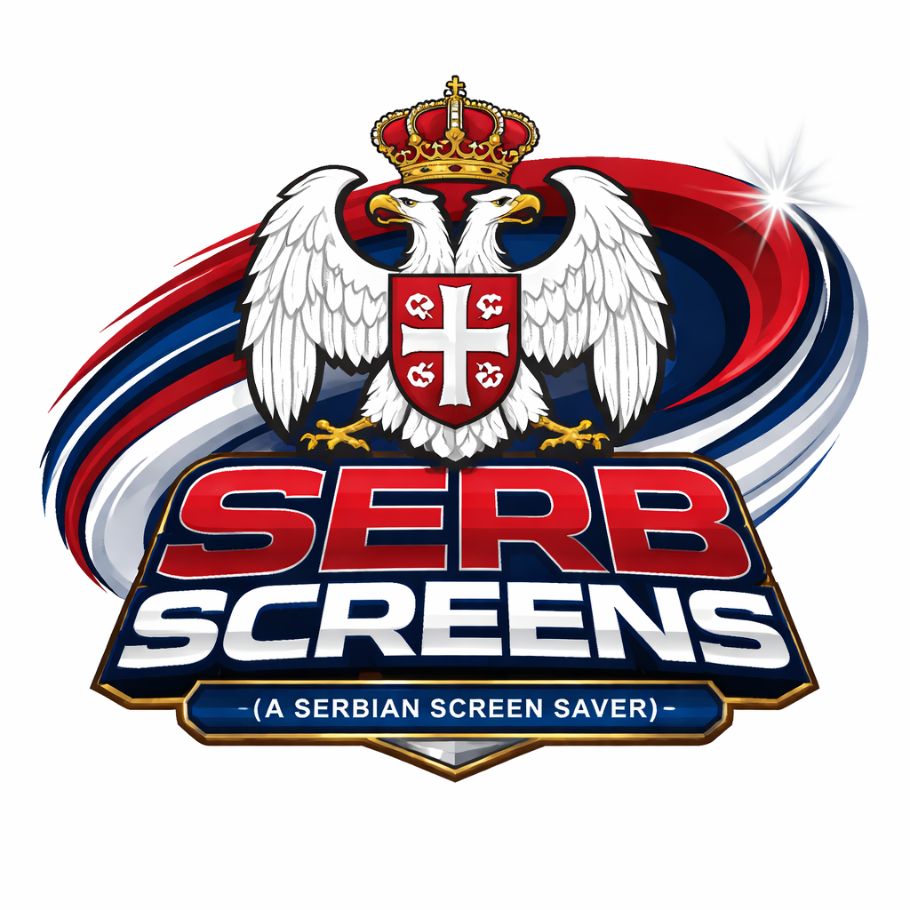

# SERB SCREENS

**(You need to know to run: Downloading Files, Zip / UnZip Files, Cut / Move and Copy / Pate Operations)**

Serb Screens is a NW.js web / js app that acts as a screen saver on all monitors

1. Serbian Cyrillic Matrix

2. Serbian National Stadiums

3. Serbian Authentic Cuisine

---

## Installation

1. Download [NW.js](https://nwjs.io/) NORMAL edition and Extract ZIP

2. Download ZIP [SS-data](https://github.com/srkidex/SS-data/archive/refs/heads/main.zip)

3. Extract ZIP to "SS-data-main" folder (make if needed) inside NW.js main folder.

4. CUT / MOVE "package.json" from "SS-data-main" UP to the folder above. 

5. RUN NW.js app (.exe, .bin ...)